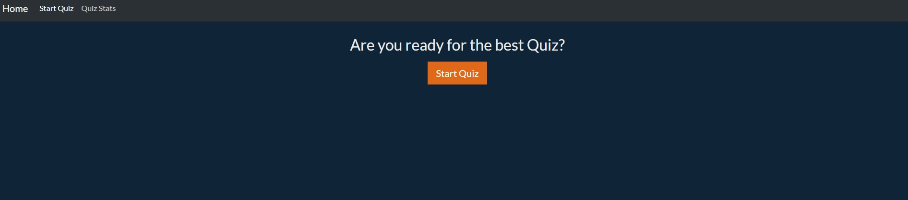
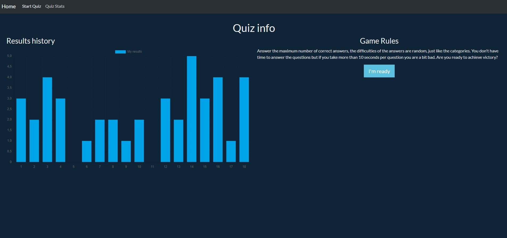
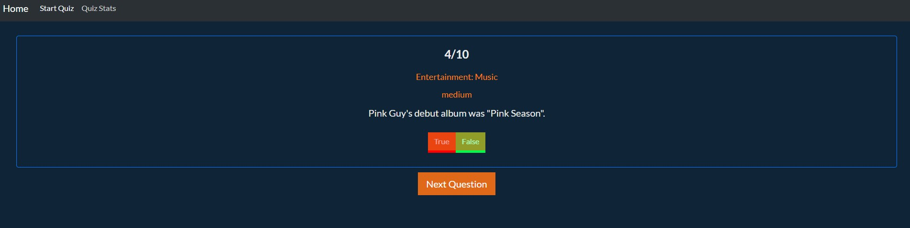
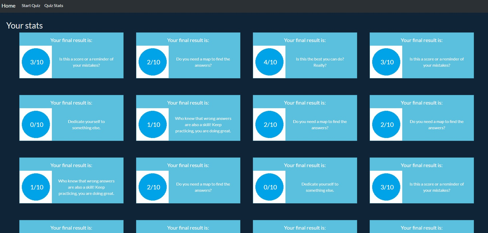

# Proyecto JavaScript Quiz

En este pryecto de JavaScript he querido hacer una SPA para crear mi Quiz. Para llevar a cabo este proyecto he utilizado lenguaje HTML CSS y JS.

## 1. SPA

Esta web esta diseñada como una Single Page Aplication o SPA y conta de una pagina de Home, la pagina del Quiz y una donde podemos ver todas nuestras puntuaciones.

## 2. Home

Esta seccion es donde aparecemos cuando cargamos la pagina. Aquí podemos ver la información del Quiz, que consta de un apartado donde tenemos una grafica con nuestros ultimos resultados y otro apartado con la información basica del juego, que incluye un boton para ir a iniciarlo.

## 3. Start Quiz

En esta sección tenemos un boton para iniciar el Quiz y una vez le damos se empiezan a mostrar las preguntas. Hasta que no seleccionemos una respuesta no nos aparecera el boton para ir a la siguiente pregunta. Al finalizar las 10 preguntas tienes la opcion de jugar otra vez o ir a ver las estadisticas.

## Quiz Stats

Aquí mostramos todos los resultados que hemos obtenido con un mensaje personalizado segun la puntuacion obtenida.

