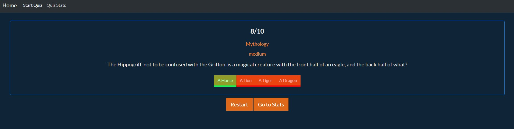

# Proyecto JavaScript Quiz

En este proyecto de JavaScript he querido hacer una SPA para crear mi Quiz. Para llevar a cabo este proyecto he utilizado lenguaje HTML, CSS y JS.

## 1. SPA

Esta web está diseñada como una Single Page Aplication o SPA y consta de una página de Home, la página del Quiz y una donde podemos ver todas nuestras puntuaciones.

## 2. Home

Esta sección es donde aparecemos cuando cargamos la página. Aquí podemos ver la información del Quiz, que consta de un apartado donde tenemos una gráfica con nuestros últimos resultados y otro apartado con la información básica del juego, que incluye un botón para ir a iniciarlo.

## 3. Start Quiz

En esta sección tenemos un botón para iniciar el Quiz y una vez le damos se empiezan a mostrar las preguntas. Hasta que no seleccionemos una respuesta no nos aparecerá el botón para ir a la siguiente pregunta. Al finalizar las 10 preguntas tienes la opción de jugar otra vez o ir a ver las estadísticas.

## 4. Quiz Stats

Aquí mostramos todos los resultados que hemos obtenido con un mensaje personalizado según la puntuación obtenida.

## 4. Lenguajes

